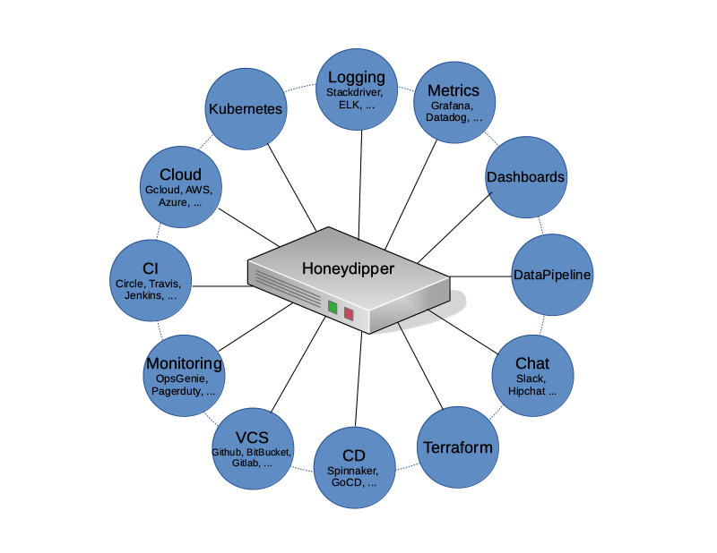
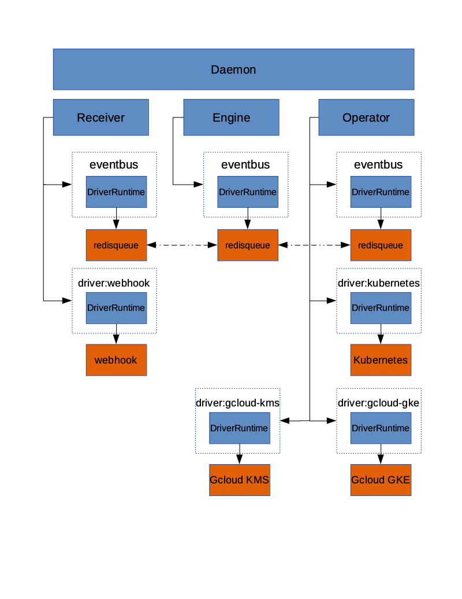

# Honeydipper

---

<!-- toc -->

- [Overview](#overview)
- [Design](#design)
  * [Vision](#vision)
  * [Core Concepts](#core-concepts)
  * [Features](#features)
    + [Embracing GitOps](#embracing-gitops)
    + [Pluggable Architecture](#pluggable-architecture)
    + [Abstraction](#abstraction)
- [More information](#more-information)
- [TODO](#todo)
- [License](#license)
- [Contributing](#contributing)

<!-- tocstop -->

## Overview

Honeydipper is an IFTTT-style, event-driven, policy-based orchestration system tailored for SREs and DevOps engineers. It acts as a central hub, composing integrations between various DevOps components as code, replacing ad-hoc solutions with a pluggable, open architecture.

The official website is https://honeydipper.io

Documentation and community resources are available at https://honeydipper.readthedocs.io/en/latest/

## Design

### Vision

Engineers face challenges with ad-hoc integrations between systems and components in DevOps environments. Honeydipper addresses this by providing a central orchestration hub, reducing redundant configurations and enabling interchangeable tools.

Our vision is for Honeydipper to act as a central hub forming an ecosystem so that the various systems and components can be plugged in together and the integrations can be composed using rules, workflows and abstracted entities like systems, projects and organizations. With a centralized orchestration, redundant configurations and development work can be reduced or eliminated. With the abstraction layer, The underlying tools and solutions become interchangeable.

The core of Honeydipper is comprised of an event bus and a rules/workflow engine. Raw events from various sources are received by corresponding event drivers, packaged in a standard format, and published to the event bus. The rules/workflow engine picks up events and triggers actions or workflows based on defined rules.

### Core Concepts

Honeydipper uses abstract concepts to compose rules:

*   **Driver (Event):** Interface for receiving raw events.
*   **Raw Event:** Data received from an external system.
*   **System (Trigger):** An abstract entity grouping dipper events and configurations.
*   **Dipper Event (DipperMessage):** Standardized data structure for events.
*   **Rules:** Define actions/workflows triggered by specific events.
*   **Features:** Functions mapped to running drivers (e.g., `eventbus` by `redisqueue`).
*   **Services:** Capabilities provided by the daemon for orchestration.
*   **Workflow:** Grouping of actions for sequential/parallel processing.
*   **Dipper Action (DipperMessage):** Standardized data structure for actions.
*   **System (Responder):** An abstract entity grouping dipper actions and configurations.
*   **Raw Action:** Action to be performed on an external system.
*   **Driver (Action):** Interface for performing actions.

### Features

#### Embracing GitOps

Honeydipper minimizes local configuration by pulling configurations from Git repositories. This provides ease of maintenance and access control through Git. Benefits include improved auditability and simplified configuration management. The system monitors Git repos for changes and reloads configurations as needed, ensuring continuous operation even with configuration errors.

#### Pluggable Architecture

Honeydipper's architecture allows dynamic loading of external drivers, enabling extension and customization. Drivers handle data mutations, communication, and interaction with external systems. This allows for flexible integration with various tools and services.

#### Abstraction

Honeydipper abstracts events and actions, allowing them to be defined independently of low-level component changes. This enables the composition of complex workflows without being tied to specific implementations. Changes to underlying components require only linking abstract events to new component-native events.

## More information

Please find the main document index at https://honeydipper.readthedocs.io/en/latest/

To install, See [Installation Guide](./docs/INSTALL.md).

For driver developers, please read this guide. [Honeydipper driver developer's guide](./docs/developer.md)

To get started on developing. See [How to setup local test environment](./docs/howtos/setup_local.md).

## TODO

*   Python driver library
*   API service
*   Dashboard webapp
*   Auditing/logging driver
*   State persistent driver
*   Repo jailing
*   RBAC

## License

Honeydipper is licensed under the [MIT License](./LICENSE).

## Contributing

Thank you for your interest! Please refer to the [Code of Conduct](./CODE_OF_CONDUCT.md) for guidance.
