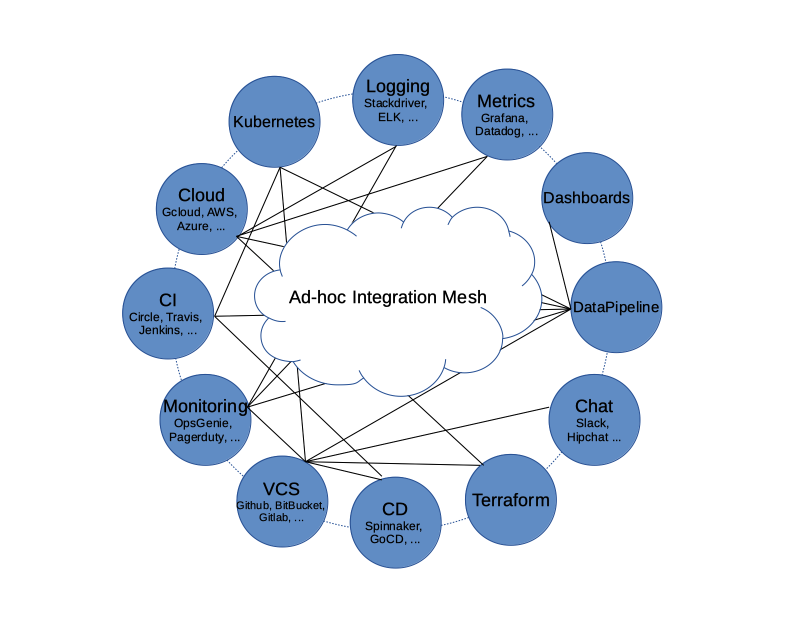
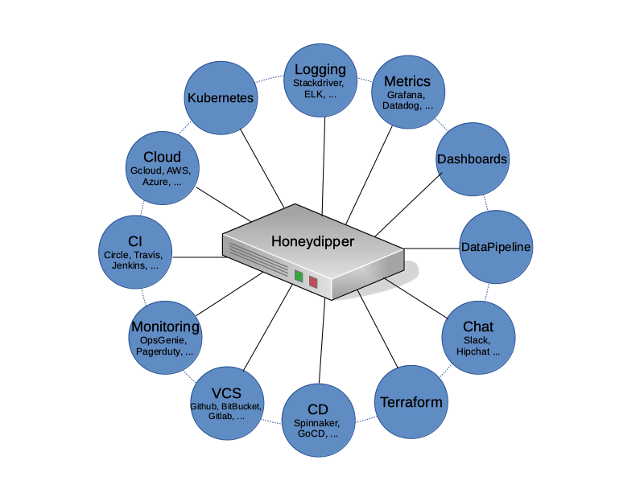

# Honeydipper

[](https://circleci.com/gh/honeydipper/honeydipper/tree/v4)
[](https://goreportcard.com/report/github.com/honeydipper/honeydipper/v4)
[](https://opensource.org/licenses/MIT)


---

<!-- toc -->

- [Overview](#overview)
- [Key Features](#key-features)
- [Quick Start](#quick-start)
- [Architecture](#architecture)
  * [Core Services](#core-services)
  * [Workflow Engine](#workflow-engine)
  * [AI Agent System](#ai-agent-system)
  * [Driver Ecosystem](#driver-ecosystem)
- [Design Principles](#design-principles)
  * [GitOps-First Configuration](#gitops-first-configuration)
  * [Pluggable Architecture](#pluggable-architecture)
  * [Abstraction & Reusability](#abstraction--reusability)
  * [Event-Driven Orchestration](#event-driven-orchestration)
- [Documentation](#documentation)
- [Contributing](#contributing)
- [License](#license)

<!-- tocstop -->

## Overview

Honeydipper is a modern, event-driven orchestration platform designed for SREs and DevOps teams. Built in Go, it acts as a central hub that connects disparate systems and tools, enabling you to compose complex workflows using a powerful rules engine and abstraction layer.

**Why Honeydipper?**



- **Replace Ad-Hoc Integrations**: Instead of building point-to-point integrations between every tool in your stack, Honeydipper provides a central orchestration layer that reduces complexity and eliminates redundancy.
- **Infrastructure as Code**: All configurations, rules, and workflows are defined as code in Git repositories, embracing GitOps principles for version control, review, and audit trails.
- **Pluggable & Extensible**: A rich driver ecosystem allows Honeydipper to integrate with any system—from cloud providers and CI/CD tools to monitoring systems and AI models.
- **AI-Enhanced**: Built-in AI agent capabilities enable intelligent automation, natural language interactions, and autonomous decision-making within your workflows.
- **Abstract & Swap**: Define abstractions over your tools and systems. Change underlying implementations without rewriting your workflows.




The official website: https://honeydipper.io

## Key Features

- 🔄 **Event-Driven Architecture**: Listen for events from webhooks, pub/sub systems, schedulers, and custom sources
- 🔀 **Powerful Workflow Engine**: Sequential steps, parallel execution, conditional branching, loops, and dynamic sub-workflows
- 🤖 **AI Agent Integration**: Built-in support for OpenAI, Gemini, Ollama, and MCP (Model Context Protocol) servers
- 🔌 **Extensible Driver System**: Builtin, remote, and custom drivers with hot-reload capabilities
- 📦 **GitOps Configuration**: Multi-repo config support with automatic refresh, staging, and rollback
- 🔐 **Secrets Management**: Integrated encryption and secrets lookup with support for Vault, AWS KMS, GCP Secret Manager
- 🌐 **REST API**: Comprehensive HTTP API with authentication (SAML, GitHub OAuth), authorization, and streaming support
- 🔧 **Dynamic Interpolation**: Powerful template system with Sprig functions, custom helpers, and deferred decryption
- 📊 **Distributed Tracing**: Event bus messaging, distributed locking, and session tracking across components
- ⚡ **High Performance**: Concurrent workflow execution, in-memory caching, and efficient message routing

## Quick Start

### Prerequisites

- Go 1.23+ (for building from source)
- Git
- Redis (for session storage and caching)
- Docker (optional, for containerized deployment)

### Installation

**Option 1: Use Docker Image**

```bash
docker run -d \
  -e REPO=https://github.com/honeydipper/honeydipper-config-essentials.git \
  -e BRANCH=main \
  honeydipper/honeydipper:v4
```

**Option 2: Build from Source**

```bash
git clone https://github.com/honeydipper/honeydipper.git
cd honeydipper
git checkout v4
go build -o honeydipper ./cmd/honeydipper
```

### Configuration

Honeydipper uses environment variables for configuration. The only required variable is `REPO`:

**Required:**
- `REPO` - Bootstrap repository URL or local path

**Optional:**
- `BRANCH` - Branch to use (defaults to main/master)
- `BOOTSTRAP_PATH` - Path within repo to load init.yaml (defaults to `/`)
- `BOOTSTRAP_FILE` - Custom init file name (defaults to `init.yaml`)

**Example:**

```bash
export REPO=https://github.com/honeydipper/honeydipper-config-essentials.git
export BRANCH=main

./honeydipper
```

### Selecting Services

By default, Honeydipper runs all 5 services (engine, receiver, operator, api, agent). You can optionally specify which services to run:

```bash
# Run only engine and operator
./honeydipper engine operator

# Run all services (default)
./honeydipper
```

**Available Services:**
- `engine` - Event routing and workflow orchestration
- `receiver` - Event ingestion from drivers
- `operator` - Function execution
- `api` - HTTP REST API
- `agent` - AI agent system

**Auxiliary Modes:**
- `configcheck` - Validate configuration files (exits after completion)
- `docgen` - Generate documentation (exits after completion)
- `job` - Run a single workflow and exit (requires `JOB_FILE` env var)

### Configuration Example

Create a bootstrap repository with `init.yaml`:

```yaml
repos:
  - repo: https://github.com/honeydipper/honeydipper-config-essentials.git
    branch: main

# Override systems to provide credentials
systems:
  github:
    data:
      # For webhook: 'token' is used for webhook validation
      # For API calls: 'pat' is used for GitHub API authentication
      token: LOOKUP[vault,secret/data/github#webhook_token]
      pat: LOOKUP[vault,secret/data/github#api_token]

  slack_bot:
    data:
      token: LOOKUP[vault,secret/data/slack#bot_token]
      signatureSecret: LOOKUP[vault,secret/data/slack#signature_secret]

rules:
  - when:
      source:
        system: github
        trigger: push
    do:
      workflow:
        call: notify
        with:
          notify:
            - "#deployments"
          message_type: success
          message: "New push to {{ .event.repository.name }}"
```

**Explanation:**

- The `systems` section overrides the `github` and `slack_bot` systems defined in the essentials repo
- Credentials are fetched securely using `LOOKUP[driver,path#key]` syntax
- The rule uses `source:` with `system:` and `trigger:` to match GitHub push events
- The `notify` workflow is called with `with:` to provide context variables
- The `notify` workflow (from `workflow_helper.yaml`) supports parameters like `notify`, `message_type`, `message`

For detailed installation instructions, see the [Installation Guide](./docs/INSTALL.md).

## Architecture

Honeydipper runs as a single daemon process that hosts up to 5 concurrent services:



### Core Services

| Service | Purpose | Key Capabilities |
|---------|---------|------------------|
| **Engine** | Event → Workflow Router | Matches events against rules, manages workflow sessions, handles conditions and exports |
| **Receiver** | Event Ingestion | Discovers event sources from rules, wires driver features, routes events to engine |
| **Operator** | Function Executor | Resolves system.function → driver.action, handles retries/backoff, executes commands |
| **API** | HTTP REST Interface | Gin-based API with auth (SAML/GitHub), user profiles, agent conversations, streaming |
| **Agent** | AI Agent System | Inference, tool calls, sub-agents, MCP servers, streaming, conversation history |

### Workflow Engine

The workflow engine is a sophisticated state machine with ~30 states that supports:

- **Conditional Execution**: `If`, `IfAny`, `Unless`, `Match` conditions with deep comparison
- **Iteration**: Sequential and parallel loops with dynamic item processing
- **Branching**: `Switch`/`Cases`/`Default` for complex decision trees
- **Error Handling**: `OnError`, `OnFailure` hooks with customizable recovery
- **Caching**: TTL-based result caching with in-memory and Redis backends
- **Export System**: Flexible data export at session, step, and action levels
- **Sub-Workflows**: Nested workflow calls with parent-child session relationships

**Workflow Actions Include**:
- Function calls (inline or referenced)
- Driver actions (raw or system.function)
- Agent inference and tool execution
- Event emission
- Conditional branching and switching
- Parallel threads with synchronization
- Resume and detach operations

### AI Agent System

Honeydipper includes a comprehensive AI agent framework:

- **Multi-Turn Conversations**: Persistent conversation state with history management
- **Tool Integration**: Automatically exposes systems, workflows, and other agents as tools
- **MCP Support**: Connect to Model Context Protocol servers for extended capabilities
- **Streaming**: Real-time response streaming for interactive experiences
- **Compaction**: Automatic conversation history compaction with configurable policies
- **Multiple Backends**: OpenAI, Gemini, Ollama, and custom AI drivers
- **Distributed State**: Redis-backed conversation state for horizontal scaling

### Driver Ecosystem

Drivers are the backbone of Honeydipper's extensibility:

**Driver Types**:
- **Builtin**: Spawned as child processes with stdin/stdout communication
- **Remote**: Downloaded from URLs or registries with SHA256 verification and Ed25519 signatures
- **Null**: No-op drivers for testing or disabling features

**Key Drivers Include**:
- Event sources (webhooks, pub/sub, schedulers)
- Action executors (cloud providers, CI/CD, incident management)
- Infrastructure (Kubernetes, Terraform, Ansible)
- Communication (Slack, email, PagerDuty)
- Storage (Redis, databases, object storage)
- Secrets (Vault, AWS KMS, GCP Secret Manager)
- AI/ML (OpenAI, Gemini, Ollama, MCP servers)

**Hot Reload**: Drivers can be reloaded without downtime—hot reload for configuration changes, cold reload for binary updates.

## Design Principles

### GitOps-First Configuration

Honeydipper minimizes local configuration through GitOps:

- **Bootstrap from Git**: Provide a repo URL and branch, and Honeydipper bootstraps itself
- **Multi-Repo Support**: Load configurations from multiple Git repositories with include patterns
- **Auto-Refresh**: Repositories are polled every 60 seconds for changes
- **Staged Loading**: Configuration goes through 5 stages (Loading → Booting → Discovering → Serving → Drained) with synchronized advancement across services
- **Rollback on Failure**: If configuration reload fails, the system automatically rolls back to the last known good state
- **Secret Decryption**: Encrypted values in config are automatically decrypted at runtime

### Pluggable Architecture

Extensibility is achieved through a driver-based architecture:

- **Standardized Protocol**: All drivers communicate via a text-based wire protocol over stdin/stdout
- **Dynamic Discovery**: Drivers are automatically discovered from rules and system definitions
- **RPC System**: Inter-service and driver communication uses a unified RPC framework with support for timeouts, interrupts, and fire-and-forget
- **Package Management**: Remote drivers can specify required OS packages for automatic installation
- **Registry Support**: Drivers can be fetched from registries with version and channel resolution

### Abstraction & Reusability

Honeydipper introduces abstraction layers to make workflows portable and reusable:

- **Systems**: Group related triggers, functions, and data together (e.g., `system: gcp`, `system: slack`)
- **Extends**: Systems can extend other systems, inheriting and overriding configurations
- **Interpolation**: Powerful template system with `$path.to.key` syntax and `{{ }}` runtime interpolation
- **Function Resolution**: `system.function` references are recursively resolved to `driver.action` with parameter merging
- **Context Export**: Workflows can export data to parent sessions, enabling composability

**Example Abstraction**:
```yaml
systems:
  my-clusters:
    extends: [kubernetes]
    data:
      source:
        type: gke
        project: my-gcp-project
        region: us-central1
        cluster: my-cluster
    functions:
      driver: kubernetes
      rawAction: start_job
      parameters:
        source: $sysData.source
        job: $ctx.k8s_job_yaml
        
  test-cluster:
    extends: [my-clusters]
    data: {source: {cluster: test} }
```

### Event-Driven Orchestration

Events flow through Honeydipper in a standardized way:

1. **Event Reception**: Drivers receive events from external systems
2. **Event Normalization**: Raw events are packaged into standard DipperMessages
3. **Rule Matching**: The engine matches events against rules using conditions
4. **Workflow Execution**: Matching rules trigger workflows with the event as input
5. **Action Execution**: The operator resolves and executes function calls
6. **Result Propagation**: Results flow back through the event bus to progress workflows

## Documentation

Comprehensive documentation is available at https://honeydipper.readthedocs.io/

**Key Documentation**:
- [Getting Started Guide](https://honeydipper.readthedocs.io/en/latest/getting-started/)
- [Configuration Reference](https://honeydipper.readthedocs.io/en/latest/configuration/)
- [Workflow DSL Documentation](https://honeydipper.readthedocs.io/en/latest/workflows/)
- [Driver Developer's Guide](./docs/developer.md)
- [API Reference](https://honeydipper.readthedocs.io/en/latest/api/)
- [AI Agent Guide](https://honeydipper.readthedocs.io/en/latest/agents/)

**Local Development**:
- [Setting Up Local Test Environment](./docs/howtos/setup_local.md)
- [Contributing Guidelines](./CONTRIBUTING.md)

## Contributing

We welcome contributions from the community! Here's how you can help:

1. **Report Bugs**: Open an issue describing the bug and steps to reproduce
2. **Suggest Features**: Open an issue with the "enhancement" label
3. **Submit Pull Requests**: Fork the repo, create a feature branch, and submit a PR
4. **Improve Documentation**: Help us keep the docs accurate and up-to-date
5. **Write Drivers**: Create new drivers to integrate with additional systems

Before contributing, please read:
- [Code of Conduct](./CODE_OF_CONDUCT.md)
- [Contributing Guidelines](./CONTRIBUTING.md)
- [Developer Guide](./docs/developer.md)

**Development Setup**:
```bash
git clone https://github.com/honeydipper/honeydipper.git
cd honeydipper
git checkout v4
go test ./...
```

## License

Honeydipper is licensed under the [MIT License](./LICENSE).


**Project Status**: Active development on v4 branch. Production-ready with comprehensive test coverage.

**Community**: Join our discussions and get help on [GitHub Discussions](https://github.com/honeydipper/honeydipper/discussions) or open an issue for bugs and feature requests.
