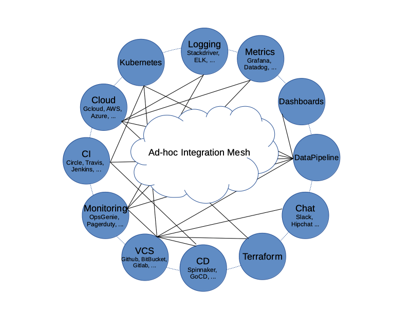

# Honeydipper

 * **master** [](https://circleci.com/gh/honeyscience/honeydipper)
 * **v0.1.2** [](https://circleci.com/gh/honeyscience/honeydipper/tree/v0.1.2)

---

<!-- toc -->

- [Overview](#overview)
- [Design](#design)
  * [Vision](#vision)
  * [Core Concepts](#core-concepts)
  * [Outstanding Features](#outstanding-features)
    + [Embracing GitOps](#embracing-gitops)
    + [Pluggable Architecture](#pluggable-architecture)
    + [Abstraction](#abstraction)
- [TODO](#todo)
- [Get Started On Developing](#get-started-on-developing)
  * [Prerequisites](#prerequisites)
  * [Setup](#setup)

<!-- tocstop -->

## Overview
A IFTTT style event-driven, policy-based orchestration system that, is tailored towards SREs and DevOps workflows, and has a pluggable open architecture. The purpose is to fill the gap between the various components used in DevOps operations, to act as an orchestration hub, and to replace the ad-hoc integrations between the components so that the all the integrations can also be composed as code.

For driver developers, please read this guide. [Honeydipper driver developer's guide](./docs/developer.md)

For everyone, please find the main document index at [docs/README.md](./docs/README.md).

## Design

### Vision
Engineers often use various systems, components to build and deliver services based on software products.  The systems and components need to interact with each other to achieve automation. There are usually integration solutions that when implemented the components/systems can operate seamlessly.  However, the integrations are usually created or configured in ad-hoc fashion.  When the number of systems/components increases, the number of integrations and complexity of the integrations sometimes become unmanageable. All the systems/components are entangled in mesh (See below graph). A lot of redundant configuration or development work become necessary. It is so hard, sometimes even impossible, to switch from one tool to another.



The vision for Honeydipper is to provide an infrastructure so that the various systems and components can be plugged in together and the integrations can be composed using rules, workflows and abstracted entities like systems, projects and organizations. With a centralized orchestration, redundant configurations and deveopment work can be reduced or eliminated. With the abstraction layer, The underline tools and solutions become swappable.


The core of Honeydipper is comprised of an event bus, and a rules/workflow engine. Raw events from various sources are received by corresponding event drivers, and then packaged in a standard format then published to the event bus. The rules/workflow  engine picks up the event from the bus, and, based on the rules, triggers the actions or a workflow with multiple actions.


### Core Concepts
In order for users to compose the rules, a few abstract concepts are introduced:

 * Driver (Event)
 * Raw Event
 * System (Trigger): an abstract entity that groups dipper events and some configurations, metadata together
 * Dipper Event (DipperMessage): a data structure that contains information that can be used for matching rules and being processed following the rules
 * Rules: if some Dipper Event on some system happens, then start the workflow of actions on certain systems accordingly
 * Features: A feature is a set of functions that can be mapped to a running driver, for example, the `eventbus` feature is fulfilled by `redisqueue` driver
 * Services: A service is a group of capabilities the daemon provides to be able to orchestrate the plugged systems through drivers 
 * Workflow: Grouping of the actions so they can be processed, sequentially, parallel, etc
 * Dipper Action (DipperMessage): a data structure that contains information that can be used for performing an action
 * System (Responder): an abstract entity that groups dipper actions, configurations, metadata together
 * Raw Action
 * Driver (Action)

As you can see, the items described above follow the order or life cycle stage of the processing of the events into actions. Ideally, anything between the drivers should be composable, while some may tend to focusing on making various systems, Dipper event/actions available, others may want to focus on rules, workflows.

### Outstanding Features

#### Embracing GitOps
Honeydipper should have little to no local configuration needed to be bootstraped.  Once bootstrapped, the system should be able to pull configurations from one or more git repo. The benefit is the ease of maintenance of the system and access control automatically provided by git repo(s). The system needs to watch the git repos, one way or another, for changes and reload as needed. For continuous operation, the system should be able to survive when there is a configuration error, and should be able to continue running with an older version of the configuration.

#### Pluggable Architecture
Drivers make up an important part of the Honeydipper ecosystem. Most of the data mutations and actual work processes are handled by the drivers, including data decryption, internal communication, and interacting with external systems. Honeydipper should be able to extend itself through loading external drivers dynamically, and when configurations change, reload the running drivers hot or cold. There should be an interface for the drivers to delegate work to each other through RPCs.

#### Abstraction
As mentioned in the concepts, one of Honeydipper's main selling points is abstraction. Events, actions can be defined traditionally using whatever characteristics provided by a driver, but also can be defined as an extension of another event/action with additional or override parameters. Events and actions can be grouped together into systems where data can be shared across. With this abstraction, we can separate the composing of complex workflows from defining low level event/action hook ups. Whenever a low level component changes, the high level workflow doesn't have to change, one only needs to link the abstract events with the new component native events.

## TODO
 * Documentation for users
 * Enhancing the driver communication protocol to support more encodings, gob, pickle
 * Python driver library
 * API service
 * Dashboard webapp
 * Auditing/logging driver
 * State persistent driver
 * Config file templating
 * Data/parameter templating
 * Repo jailing
 * RBAC

## Get Started On Developing

### Prerequisites
If you're using Redis's pubsub, you'll need to run Redis and configure the driver in your configuration, e.g.,
```yaml
drivers:
  redisqueue:
    connection:
      Addr: 10.0.0.5:6379
```

### Setup

Setup a directory as your go work directory and add it to `$GOPATH`. Assuming go 1.11 or up is installed, gvm is recommended to manage multiple versions of go. You may want to set `$GOPATH` in your shell init files, as well as add `$GOPATH/bin` to your `$PATH`.

    $ mkdir gocode
    $ export GOPATH=$GOPATH:$PWD/gocode

Clone the code:

    $ cd gocode
    $ mkdir -p src/github.com/honeyscience/
    $ cd src/github.com/honeyscience/
    $ git clone git@github.com:honeyscience/honeydipper.git

Load the dependencies:

    $ brew install dep ## on OS X
    $ cd honeydipper
    $ dep ensure

Build and install:

    $ go install ./...

Run the tests:

    $ go test -v ./...

(Optional) For colored test results:

    $ go get -u github.com/rakyll/gotest
    $ gotest -v ./...

(Optional) For pre-commit hooks:

    $ pip install pre-commit
    $ pre-commit install --install-hooks

Start your local dipper daemon, see admin guide(coming soon) for detail:

    $ REPO=file:///path/to/your/rule/repo honeydipper
